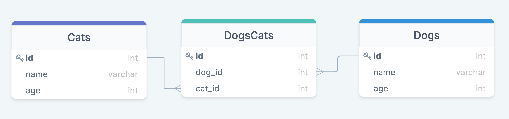

# Sequelize intro

## Как начинали работу

1.  `npm init -y` - инициализируем проект node
1.  `npm i sequelize pg pg-hstore` - устанавливаем зависимости postgres
1.  `npm i -D sequelize-cli` - устанавливаем sequelize cli
1.  создаём файл `.sequelizerc`:

```Javascript
 const path = require('path');
 module.exports = {
 'config': path.resolve('db', 'config', 'config.json'),
 'models-path': path.resolve('db', 'models'),
 'seeders-path': path.resolve('db', 'seeders'),
 'migrations-path': path.resolve('db', 'migrations')
 };
```

1. `npx sequelize-cli init` - создаём структуру для работы с sequelize
1. В файле `config.json` изменили данные для БД (username, password, database, dialect) на свои. Обратите внимание, что мы ввели разные данные для development и test
1. Для того, чтобы sequelize следил за сидерами (не накатывались те сидеры, которые уже были добавлены в БД, аналогично миграциям),в файл `config.json` добавили строчки

```
    "seederStorage": "sequelize",
    "seederStorageTableName": "SequelizeData"
```

## Что сделали

1.  Создали необходимое кол-во моделей командой `npx sequelize-cli model:generate --name cats --attributes name:string,age:integer` (изменили под себя)
    - Одновременно с этим создалась миграция
    - **Если поменяли что-то в модели - меняем и в миграции**
1.  Накатили миграцию `npx sequelize-cli db:migrate`
1.  Создали seeder командой `npx sequelize-cli seed:generate --name demo-user` (изменили под себя)

## На что обратить внимание

1.  Когда пишем seeder, поля `createdAt` и `updatedAt` нужно заполнить самому `new Date()`

### Связи

**_Важно_**

Если в миграции вы указываете, что какое-то поле _таблицы А_ ссылается на _Таблицу В_, то на момент накатывания миграции с _Таблицей А_, уже должна существовать _Таблица В_. В обратном случае, вы получите ошибку `Table_name is not exist`.


## Many to many

### Идея

Есть три таблицы: dogs, cats и dogscats. Многие собаки могут дружить с многими кошками. Связь между кошками и собаками описывается в таблице `dogscats`.

  
_Таблица 1_. Связь Many-to-Many.

### Модели

1. В модели dogs, в методе associate нужно описать связь с многими котами через промежуточную таблицу:

   ```Javascript
   static associate(models) {
         this.belongsToMany(models.dogs, { through: models.dogscats, foreignKey: 'cat_id' });
       }
   ```

1. В модели cats нужно сделать аналогичную связь:

   ```Javascript
     static associate(models) {
           this.belongsToMany(models.cats, { through: models.dogscats, foreignKey: 'dog_id' });
         }
   ```

1. В модели Dogscats _ничего делать не нужно_

### Миграции

1. В миграции `dogscats` указываем, что столбцы `cat_id` и `dog_id` ссылаются на таблицы `Cats` и `Dog` соответсвенно

   ```Javascript
        dog_id: {
       type: Sequelize.INTEGER,
       references: {
         model: 'Dogs', // tableName
         key: 'id',
       },
        },
        cat_id: {
        type: Sequelize.INTEGER,
        references: {
         model: 'Cats', // tableName
         key: 'id',
       },
       },
   ```

1. В миграциях для моделей `cats` и `dogs` ничего делать не нужно
